# Diagrama de Clases - Backend DocuSeal

Este documento contiene el diagrama de clases del backend de DocuSeal, enfocado en el servicio web y los endpoints de la API.

## Diagrama de Clases

```mermaid
classDiagram
    %% ==================== CAPA DE API - MAIN ====================
    class FastAPI_Main {
        +FastAPI app
        +mount_applications()
        +serve_frontend()
    }

    %% ==================== CAPA DE API - ADMIN ====================
    class AdminAPI {
        +FastAPI app
        -DBManager db_manager
        -ConfiguracionLogin login_service
        -ConfiguracionRegistro registro_service
        -ConfiguracionCertificados certificados_service
        +health_check()
        +root()
        +register_usuario(UsuarioRegistroRequest)
        +login_usuario(UsuarioLoginRequest)
        +obtener_certificados(clave_usuario)
        +subir_certificados(data)
        +eliminar_certificado(id)
    }

    %% ==================== CAPA DE API - SERVICE ====================
    class ServiceAPI {
        +FastAPI app
        +include_routers()
    }

    class TimbradoRouter {
        +APIRouter router
        +timbrar_endpoint(data)
    }

    class SelladoRouter {
        +APIRouter router
        +sellar_endpoint(data)
        +timbrar_sellar_endpoint(data)
    }

    class UtilitiesRouter {
        +APIRouter router
        +health_check()
        +procesar_comprobante_endpoint(data)
    }

    class CancelacionRouter {
        +APIRouter router
        +cancelar_endpoint(data)
    }

    class StatusRouter {
        +APIRouter router
        +status_endpoint(data)
    }

    %% ==================== CAPA DE SERVICIOS ====================
    class ServicioTimbrado {
        <<static>>
        +timbrar(data: dict) dict
        -_obtener_certificado(clave_usuario)
        -_validar_datos_entrada(data)
    }

    class ServicioSellado {
        <<static>>
        +sellar(data: dict) dict
        -_procesar_xml_directo(data)
        -_procesar_json(data)
    }

    class ServicioTimbrarSellar {
        <<static>>
        +timbrar_sellar(data: dict) dict
    }

    class ServicioCancelacion {
        <<static>>
        +cancelar(data: dict) dict
        -_obtener_certificado(clave_usuario)
        -_validar_datos_entrada(data)
    }

    class ServiceStatusComprobante {
        <<static>>
        +verificar_estatus(data: dict) dict
        +Verificar_timbrado(xml_string: str) bool
    }

    %% ==================== CAPA DE NEGOCIO - CORE ====================
    class SellarXML {
        -int id
        -str xml
        -bytes cer_bytes
        -bytes key_bytes
        -str password
        -str xmlSellado
        -str cadena_original
        +__init__(id, xml, cer_bytes, key_bytes, password, xmlSellado)
        +get_sello() str
        +get_cadena_original() str
        +sellar_cfdi(data: dict)$ dict
        +obtener_datos_certificado_por_clave(claveUsuario)$ dict
        +procesar_sellado(xml, cer_bytes, key_bytes, password)$ SellarXML
    }

    class TimbradoService {
        +timbrar_cfdi(xml, usuario_pac, contrasena_pac, pruebas)$ dict
        +timbrar(xml, usuario_pac, contrasena_pac, pruebas) dict
        -_procesar_timbrado(xml, usuario_pac, contrasena_pac, pruebas)$ dict
    }

    class ResultadoTimbrado {
        <<utility>>
        +ResultadoExito(doc)$ dict
        +ResultadoError(exception)$ dict
    }

    class ResultadoCancelacion {
        <<utility>>
        +ResultadoExito(uuid, data)$ dict
        +ResultadoError(uuid, error, detalle)$ dict
        +ResultadoMultiple(resultados)$ dict
        -_cargar_matriz_errores()$ dict
    }

    class StatusComprobante {
        <<utility>>
        +Verificar_status_cfdi(xml: str)$ dict
    }

    class CancelacionService {
        -dict MOTIVOS_MAP
        +cancelar_uuid(uuid, rfc_receptor, total, tipo_comprobante, motivo, ...)$ dict
    }

    class PDF {
        -str xml_sellado
        -str uuid
        -str html_generado
        -str html_path
        -str temp_dir
        +__init__(xml_sellado, uuid)
        +generar_html() Tuple
        +generar_pdf_desde_html(html_path) Tuple
        +obtener_pdf_base64() str
    }

    class Correo {
        -str destinatario
        -str asunto
        -str cuerpo
        -list adjuntos
        +__init__(destinatario, asunto, cuerpo)
        +agregar_adjunto(archivo_path, nombre)
        +enviar() bool
    }

    %% ==================== CAPA DE NEGOCIO - CFDI ====================
    class ComprobanteFactory {
        <<factory>>
        -dict _TIPO_CLASSES
        +crear_comprobante(datos_json)$ Comprobante
        +procesar_comprobante(datos_json)$ dict
    }

    class ComprobanteIngreso {
        -dict datos_json
        -dict comprobante
        -list errores
        -list warnings
        +__init__(datos_json)
        +validar() dict
        +generar_xml() str
        -_validar_estructura()
        -_validar_emisor()
        -_validar_receptor()
        -_validar_conceptos()
        -_validar_impuestos()
    }

    class ComprobanteTraslado {
        -dict datos_json
        -dict comprobante
        -list errores
        -list warnings
        +__init__(datos_json)
        +validar() dict
        +generar_xml() str
        -_validar_estructura()
        -_validar_ubicaciones()
        -_validar_mercancias()
    }

    class ValidadorCFDI {
        -dict datos
        -dict comprobante
        -list resultado
        +__init__(xml)
        +agregar(tipo, codigo, mensaje)
        +validar_totales()
        +validar_impuestos()
        +validar_conceptos()
        +obtener_resultado() list
    }

    class ConvertirJson {
        <<utility>>
        +convertir_xml_a_json(xml_string)$ dict
        +convertir_json_a_xml(json_data)$ str
    }

    %% ==================== CAPA DE CONFIGURACIÓN ====================
    class ConfiguracionLogin {
        -DBManager db_manager
        +__init__(db_manager)
        +verificar_password(password_plano, password_hash) bool
        +obtener_usuario(email) dict
        +autenticar_usuario(credenciales) dict
        +validar_sesion_activa(user_id) bool
        +registrar_ultimo_login(user_id)
    }

    class ConfiguracionRegistro {
        -DBManager db_manager
        +__init__(db_manager)
        +registrar_usuario(usuario) dict
        +hashear_password(password)$ str
        +validar_password(password) bool
        +email_existe(email) bool
    }

    class ConfiguracionCertificados {
        -DBManager db_manager
        +__init__(db_manager)
        +extraer_info_certificado(cer_bytes)$ dict
        +obtener_todos() list
        +obtener_por_usuario(usuario_pac) dict
        +obtener_por_id(id) dict
        +obtener_por_clave_usuario(clave_usuario) dict
        +crear_certificado(datos) int
        +actualizar_certificado(id, datos) bool
        +eliminar_certificado(id) bool
        +activar_desactivar(id, activo) bool
    }

    class ConfiguracionSello {
        -DBManager db_manager
        +__init__(db_manager)
        +validar_certificado(cer_bytes) bool
        +validar_llave_privada(key_bytes, password) bool
    }

    %% ==================== CAPA DE DATOS ====================
    class DBManager {
        +__init__()
        +_get_connection() Connection
        +insert_certificado(params) int
        +get_certificado_by_usuario(usuario_pac) dict
        +get_certificado_by_id(id) dict
        +get_certificado_by_clave_usuario(clave_usuario) dict
        +get_all_certificados() list
        +update_certificado(id, params) bool
        +delete_certificado(id) bool
        +insert_usuario(name, email, password_hash) int
        +get_usuario_by_email(email) dict
        +get_usuario_by_id(id) dict
    }

    %% ==================== MODELOS DE DATOS ====================
    class UsuarioLoginRequest {
        +EmailStr email
        +str password
    }

    class UsuarioRegistroRequest {
        +str name
        +EmailStr email
        +str password
        +str confirmPassword
    }

    %% ==================== RELACIONES PRINCIPALES ====================
    
    %% Main monta las sub-aplicaciones
    FastAPI_Main --> AdminAPI : mounts
    FastAPI_Main --> ServiceAPI : mounts
    
    %% Service API incluye routers
    ServiceAPI --> TimbradoRouter : includes
    ServiceAPI --> SelladoRouter : includes
    ServiceAPI --> UtilitiesRouter : includes
    ServiceAPI --> CancelacionRouter : includes
    ServiceAPI --> StatusRouter : includes
    
    %% Routers usan servicios
    TimbradoRouter --> ServicioTimbrado : uses
    SelladoRouter --> ServicioSellado : uses
    SelladoRouter --> ServicioTimbrarSellar : uses
    SelladoRouter --> ComprobanteFactory : uses
    CancelacionRouter --> ServicioCancelacion : uses
    StatusRouter --> ServiceStatusComprobante : uses
    
    %% Servicios usan clases de negocio
    ServicioTimbrado --> TimbradoService : uses
    ServicioTimbrado --> ConfiguracionCertificados : uses
    ServicioTimbrado --> PDF : uses
    ServicioTimbrado --> Correo : uses
    
    ServicioSellado --> SellarXML : uses
    ServicioSellado --> ComprobanteFactory : uses
    
    ServicioTimbrarSellar --> SellarXML : uses
    ServicioTimbrarSellar --> TimbradoService : uses
    ServicioTimbrarSellar --> PDF : uses
    ServicioTimbrarSellar --> Correo : uses
    
    ServicioCancelacion --> CancelacionService : uses
    ServicioCancelacion --> ConfiguracionCertificados : uses
    ServicioCancelacion --> ResultadoCancelacion : uses
    
    ServiceStatusComprobante --> StatusComprobante : uses
    
    %% Clases de negocio
    SellarXML --> DBManager : uses
    SellarXML --> ConfiguracionCertificados : uses
    
    TimbradoService --> ResultadoTimbrado : uses
    
    CancelacionService --> ResultadoCancelacion : uses
    CancelacionService --> ConfiguracionCertificados : uses
    
    StatusComprobante --> DBManager : uses
    
    %% Factory pattern
    ComprobanteFactory --> ComprobanteIngreso : creates
    ComprobanteFactory --> ComprobanteTraslado : creates
    
    ComprobanteIngreso --> ValidadorCFDI : uses
    ComprobanteTraslado --> ValidadorCFDI : uses
    
    %% Admin API usa configuraciones
    AdminAPI --> ConfiguracionLogin : uses
    AdminAPI --> ConfiguracionRegistro : uses
    AdminAPI --> ConfiguracionCertificados : uses
    AdminAPI --> DBManager : uses
    
    %% Configuraciones usan DBManager
    ConfiguracionLogin --> DBManager : uses
    ConfiguracionRegistro --> DBManager : uses
    ConfiguracionCertificados --> DBManager : uses
    ConfiguracionSello --> DBManager : uses
    
    %% Modelos de datos
    ConfiguracionLogin ..> UsuarioLoginRequest : uses
    ConfiguracionRegistro ..> UsuarioRegistroRequest : uses
```

## Descripción de Capas

### 1. Capa de API (FastAPI)
- **FastAPI_Main**: Aplicación principal que monta las sub-aplicaciones Admin y Service
- **AdminAPI**: API administrativa para gestión de usuarios y certificados
- **ServiceAPI**: API pública para servicios de sellado y timbrado de CFDI

### 2. Capa de Routers
- **TimbradoRouter**: Endpoints para timbrado de CFDI
- **SelladoRouter**: Endpoints para sellado de CFDI y sellado+timbrado
- **UtilitiesRouter**: Endpoints utilitarios y health checks
- **CancelacionRouter**: Endpoints para cancelación de CFDI
- **StatusRouter**: Endpoints para verificación de estatus de CFDI

### 3. Capa de Servicios
- **ServicioTimbrado**: Lógica de negocio para timbrado
- **ServicioSellado**: Lógica de negocio para sellado
- **ServicioTimbrarSellar**: Lógica de negocio para sellado y timbrado combinados
- **ServicioCancelacion**: Lógica de negocio para cancelación de CFDI
- **ServiceStatusComprobante**: Lógica de negocio para verificación de estatus

### 4. Capa de Negocio - Core
- **SellarXML**: Sellado criptográfico de CFDI
- **TimbradoService**: Interacción con PAC para timbrado
- **CancelacionService**: Interacción con PAC para cancelación usando satcfdi
- **StatusComprobante**: Verificación de estatus de CFDI con el SAT
- **ResultadoTimbrado**: Formateo de resultados de timbrado
- **ResultadoCancelacion**: Formateo de resultados de cancelación con matriz de errores
- **PDF**: Generación de PDFs desde XML
- **Correo**: Envío de correos electrónicos con adjuntos

### 5. Capa de Negocio - CFDI
- **ComprobanteFactory**: Factory para crear diferentes tipos de comprobantes
- **ComprobanteIngreso**: Validación y generación de comprobantes de ingreso
- **ComprobanteTraslado**: Validación y generación de comprobantes de traslado
- **ValidadorCFDI**: Validación de reglas de negocio del CFDI
- **ConvertirJson**: Utilidades para conversión XML/JSON

### 6. Capa de Configuración
- **ConfiguracionLogin**: Autenticación de usuarios
- **ConfiguracionRegistro**: Registro de nuevos usuarios
- **ConfiguracionCertificados**: Gestión de certificados PAC
- **ConfiguracionSello**: Validación de certificados y llaves

### 7. Capa de Datos
- **DBManager**: Gestor de base de datos PostgreSQL
- **InterpreteJson**: Utilidades para interpretar y formatear respuestas

### 8. Modelos de Datos
- **UsuarioLoginRequest**: Modelo para solicitud de login
- **UsuarioRegistroRequest**: Modelo para solicitud de registro
