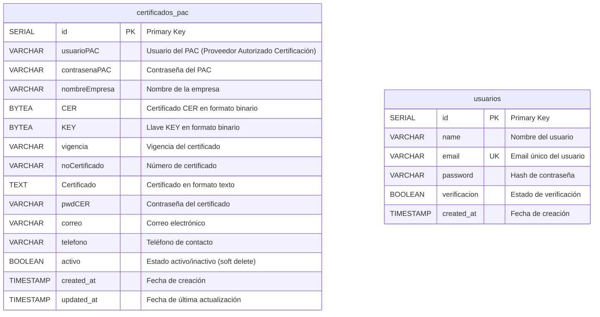

# Base de Datos - DocuSeal

## Diagrama de Entidad-Relación (ERD)



## Descripción de Tablas

### 1. certificados_pac

Almacena los certificados digitales del PAC (Proveedor Autorizado de Certificación) utilizados para el sellado y timbrado de CFDIs (Comprobantes Fiscales Digitales por Internet).

**Columnas principales:**
- `id`: Identificador único autoincrementable
- `usuarioPAC`: Usuario proporcionado por el PAC para autenticación
- `contrasenaPAC`: Contraseña del PAC (se recomienda encriptación)
- `nombreEmpresa`: Razón social o nombre de la empresa asociada
- `CER`: Archivo de certificado (.cer) almacenado como BYTEA (binario)
- `KEY`: Archivo de llave privada (.key) almacenado como BYTEA (binario)
- `pwdCER`: Contraseña para desencriptar la llave privada
- `vigencia`: Fecha o periodo de vigencia del certificado
- `noCertificado`: Número único del certificado del SAT
- `Certificado`: Contenido del certificado en formato texto/PEM
- `correo`: Email de contacto del titular del certificado
- `telefono`: Teléfono de contacto
- `activo`: Campo booleano para implementar soft delete (eliminación lógica)
- `created_at`: Timestamp de creación del registro
- `updated_at`: Timestamp de última modificación

**Índices recomendados:**
- Primary Key en `id`
- Índice en `usuarioPAC` (consultas frecuentes)
- Índice en `noCertificado` (búsquedas por número de certificado)
- Índice en `activo` (filtrado de registros activos/inactivos)

### 2. usuarios

Almacena información de los usuarios del sistema administrativo.

**Columnas principales:**
- `id`: Identificador único autoincrementable
- `name`: Nombre completo del usuario
- `email`: Correo electrónico único (usado para login)
- `password`: Hash de la contraseña (bcrypt/argon2 recomendado)
- `verificacion`: Estado de verificación de email (true/false)
- `created_at`: Timestamp de registro del usuario

**Índices:**
- Primary Key en `id`
- Unique constraint en `email`

**Seguridad:**
- Las contraseñas deben almacenarse hasheadas con bcrypt o argon2
- El campo `verificacion` permite implementar confirmación por email

## Configuración de Conexión

**Motor de Base de Datos:** PostgreSQL

**Ubicación del archivo de configuración:**
- `backend/app/DB/.env`

**Variables de entorno:**
```env
DB_HOST=localhost          # Host del servidor PostgreSQL
DB_PORT=5432              # Puerto (default 5432)
DB_NAME=certificados_pac  # Nombre de la base de datos
DB_USER=postgres          # Usuario de PostgreSQL
DB_PASSWORD=***           # Contraseña (no commitear en producción)
DB_SSL_MODE=prefer        # Modo SSL
```

## Scripts de Inicialización

El archivo `backend/app/DB/settings.py` contiene la función `init_database()` que:
1. Crea la base de datos si no existe
2. Crea las tablas con sus esquemas
3. Configura timestamps automáticos

**Ejecutar inicialización:**
```powershell
cd backend/app/DB
python settings.py
```

## Migraciones

Las migraciones están ubicadas en la carpeta `/migrations`:
- `add_activo_field.sql` - Agrega campo de soft delete
- `add_pwdcer_field.sql` - Agrega campo de contraseña del certificado
- `migrate_add_activo_field.py` - Script Python para migración de activo
- `migrate_add_pwdcer_field.py` - Script Python para migración de pwdCER

## Operaciones CRUD

El archivo `backend/app/DB/DBManager.py` proporciona métodos para:

### Certificados PAC:
- `insert_certificado()` - Crear nuevo certificado
- `get_certificado_by_usuario()` - Obtener por usuario PAC
- `get_certificado_by_noCertificado()` - Obtener por número de certificado
- `get_all_certificados()` - Listar certificados activos
- `get_certificados_inactivos()` - Listar certificados inactivos
- `update_certificado()` - Actualizar certificado
- `delete_certificado()` - Soft delete (marca como inactivo)
- `reactivar_certificado()` - Reactivar certificado inactivo

### Usuarios:
- `insert_usuario()` - Crear nuevo usuario
- `get_usuario_by_email()` - Obtener usuario por email
- `update_verificacion()` - Actualizar estado de verificación

## Consideraciones de Seguridad

1. **Datos sensibles:** Los campos `contrasenaPAC`, `password`, y `pwdCER` contienen información sensible
2. **Encriptación en reposo:** Considerar encriptar datos binarios (CER/KEY) a nivel de aplicación
3. **Soft Delete:** La tabla `certificados_pac` usa eliminación lógica mediante el campo `activo`
4. **Auditoría:** Los campos `created_at` y `updated_at` permiten trazabilidad
5. **Backups:** Implementar respaldos automáticos regulares de la base de datos

## Notas Adicionales

- Los archivos CER y KEY se almacenan como BYTEA (datos binarios) en PostgreSQL
- Se convierten a Base64 en las respuestas API para facilitar el transporte
- El número de certificado (`noCertificado`) es único por certificado del SAT
- La vigencia del certificado debe validarse antes de cada operación de sellado/timbrado
